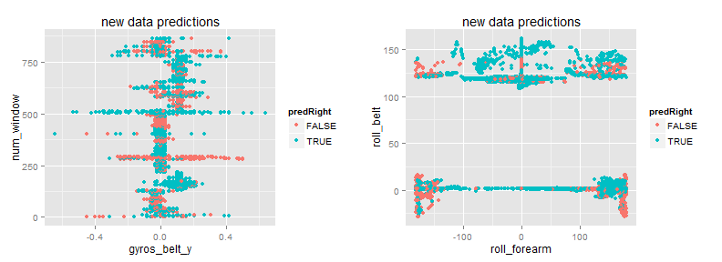

PRACTICAL MACHINE LEARNING
===================================================
Week 3 project using Random Forests
===================================================
## by Mauricio G. Tec


This project is a demostration of the prediction algorithm know as *Random Forests*. The ideas of this method are (1) to create various decision trees sampling both from the set of observations and from the set of variables and (2) to average the prediction probabilities of each tree given a new observation not in the original dataset. 

This project is part of the course "Practical Machine Learing" in the Coursera Specialization in Data Science by the John Hopkins University. All the impliementation is done using the *caret* package in R as demonstrated in the course. 

### Description of the data:

*Note* : this excerpt is taken directly from the description of the assignment in the course page.

Using devices such as Jawbone Up, Nike FuelBand, and Fitbit it is now possible to collect a large amount of data about personal activity relatively inexpensively. These type of devices are part of the quantified self movement of a group of enthusiasts who take measurements about themselves regularly to improve their health, to find patterns in their behavior, or because they are tech geeks. One thing that people regularly do is quantify how much of a particular activity they do, but they rarely quantify how well they do it. In this project, the goal will be to use data from accelerometers on the belt, forearm, arm, and dumbell of 6 participants. They were asked to perform barbell lifts correctly and incorrectly in 5 different ways. More information is available from the website here: http://groupware.les.inf.puc-rio.br/har.

### Project outline:
1. Since we do not know what is thea real class of the observations in the testing set that has been provided, in order to demonstrate the technique, we first split the training set in a training subset and in a testing set. Furthermore, the training subset is reduced to 100 observations, since the *Random Forests* demands a lot of computation power and time. We show (a) a predicting table comparing the predictions and real resuls in the testing set, (b) a sample tree and (c) two graphs chosen showing comparisons between predictors and accuracy in prediction.

2. We now implement the full model with cross validation. We have decided to use 10-fold cross validation, although only three repetitions were used for computational reasons. Fuerthermore, the total number of observations in the training set had to be reduced to 2000 observations.  


## 1) Demonstration implementation with fewer observations and splitting of the training set

First we load the necessary packages and data in R


```r
library(caret)
library(ggplot2)
library(gridExtra)

set.seed(110104)

training <- read.csv("pml-training.csv")[ ,-1]
# remove   columns with NA's or empty values
training <- training[ ,!sapply(training, function(x) 
  any(is.na(x) | (x=="")))] 
testing <- read.csv("pml-testing.csv")[ ,-1]
# matching the variables in testing and training sets
vars <- names(training) 
testing <- testing[ ,names(testing) %in% vars]
```

Now, we will split the trianing set in subsets for training and testing in the first part of our project. We also use the function sample to take a subset of size 100.


```r
inTraining <- createDataPartition(training$classe, p = .6, list = FALSE)
training.sub <- training[inTraining, ]
testing.sub <- training[-inTraining, ]
# For demonstration purposes we only use 250 observations
training.sub <- training.sub[sample(dim(training.sub)[1], 100), ]
```

The following command fits the model using random forests.


```r
modFit.dem <- train(classe ~., data=training.sub, method="rf")
modFit.dem
```

```
## Random Forest 
## 
## 100 samples
##  58 predictor
##   5 classes: 'A', 'B', 'C', 'D', 'E' 
## 
## No pre-processing
## Resampling: Bootstrapped (25 reps) 
## 
## Summary of sample sizes: 100, 100, 100, 100, 100, 100, ... 
## 
## Resampling results across tuning parameters:
## 
##   mtry  Accuracy  Kappa   Accuracy SD  Kappa SD
##    2    0.5061    0.3598  0.08715      0.10559 
##   41    0.4857    0.3435  0.08349      0.09601 
##   80    0.4736    0.3266  0.08386      0.09867 
## 
## Accuracy was used to select the optimal model using  the largest value.
## The final value used for the model was mtry = 2.
```

We know compare the predicted results agains the real results in the testing subset created earlier (not in the final testing subset of 20 individuals of which we do not know the real value, but in the one separated from the original training set).

```r
pred <- predict(modFit.dem, testing.sub)
testingTRUE <- testing.sub$classe
predRight <- pred==testingTRUE
table(pred, testingTRUE)
```

```
##     testingTRUE
## pred    A    B    C    D    E
##    A 2101  548  694  314  157
##    B   11  758   38   20  134
##    C   31   80  443   54   14
##    D   28   35   87  637   58
##    E   61   97  106  261 1079
```

Here we see an example of a tree

```r
tree <- getTree(modFit.dem$finalModel, k=3, labelVar=TRUE)
tree
```

```
##    left daughter right daughter                      split var split point
## 1              2              3                   gyros_belt_y   1.350e-01
## 2              4              5                     num_window   6.870e+02
## 3              0              0                           <NA>   0.000e+00
## 4              6              7                   roll_forearm   1.350e+02
## 5              8              9                      roll_belt   1.160e+02
## 6             10             11                    gyros_arm_x  -4.000e-02
## 7             12             13 cvtd_timestamp05/12/2011 14:24   5.000e-01
## 8             14             15               accel_dumbbell_x  -8.000e+01
## 9              0              0                           <NA>   0.000e+00
## 10            16             17                   magnet_arm_y   2.390e+02
## 11            18             19                   accel_belt_z  -2.035e+02
## 12            20             21                  magnet_belt_x   4.900e+01
## 13             0              0                           <NA>   0.000e+00
## 14             0              0                           <NA>   0.000e+00
## 15             0              0                           <NA>   0.000e+00
## 16            22             23                    yaw_forearm  -1.003e+02
## 17            24             25              magnet_dumbbell_y   2.295e+02
## 18             0              0                           <NA>   0.000e+00
## 19            26             27                  new_windowyes   5.000e-01
## 20            28             29              magnet_dumbbell_y   4.230e+02
## 21             0              0                           <NA>   0.000e+00
## 22             0              0                           <NA>   0.000e+00
## 23            30             31                gyros_forearm_y   1.125e+00
## 24             0              0                           <NA>   0.000e+00
## 25             0              0                           <NA>   0.000e+00
## 26            32             33                    gyros_arm_x   3.550e-01
## 27             0              0                           <NA>   0.000e+00
## 28            34             35                    yaw_forearm  -2.510e+01
## 29             0              0                           <NA>   0.000e+00
## 30            36             37                accel_forearm_x  -1.265e+02
## 31             0              0                           <NA>   0.000e+00
## 32             0              0                           <NA>   0.000e+00
## 33            38             39              magnet_dumbbell_z   5.250e+01
## 34            40             41                   magnet_arm_z  -3.625e+02
## 35             0              0                           <NA>   0.000e+00
## 36             0              0                           <NA>   0.000e+00
## 37             0              0                           <NA>   0.000e+00
## 38            42             43                   gyros_belt_z  -5.000e-02
## 39            44             45           raw_timestamp_part_1   1.323e+09
## 40             0              0                           <NA>   0.000e+00
## 41             0              0                           <NA>   0.000e+00
## 42             0              0                           <NA>   0.000e+00
## 43            46             47                    gyros_arm_y  -8.550e-01
## 44             0              0                           <NA>   0.000e+00
## 45             0              0                           <NA>   0.000e+00
## 46             0              0                           <NA>   0.000e+00
## 47            48             49                   gyros_belt_z   2.100e-01
## 48             0              0                           <NA>   0.000e+00
## 49             0              0                           <NA>   0.000e+00
##    status prediction
## 1       1       <NA>
## 2       1       <NA>
## 3      -1          E
## 4       1       <NA>
## 5       1       <NA>
## 6       1       <NA>
## 7       1       <NA>
## 8       1       <NA>
## 9      -1          C
## 10      1       <NA>
## 11      1       <NA>
## 12      1       <NA>
## 13     -1          D
## 14     -1          A
## 15     -1          B
## 16      1       <NA>
## 17      1       <NA>
## 18     -1          E
## 19      1       <NA>
## 20      1       <NA>
## 21     -1          A
## 22     -1          D
## 23      1       <NA>
## 24     -1          C
## 25     -1          D
## 26      1       <NA>
## 27     -1          A
## 28      1       <NA>
## 29     -1          D
## 30      1       <NA>
## 31     -1          B
## 32     -1          A
## 33      1       <NA>
## 34      1       <NA>
## 35     -1          E
## 36     -1          A
## 37     -1          E
## 38      1       <NA>
## 39      1       <NA>
## 40     -1          D
## 41     -1          E
## 42     -1          A
## 43      1       <NA>
## 44     -1          B
## 45     -1          D
## 46     -1          B
## 47      1       <NA>
## 48     -1          D
## 49     -1          E
```

Here we see an example of comparing predictors with accuracy of predictions. The predictos are taken in order of appearance as nods in the previously extracted tree.


```r
classvars <- na.omit(as.character(tree[ ,"split var"]))[1:4]
classvars
```

```
## [1] "gyros_belt_y" "num_window"   "roll_forearm" "roll_belt"
```

```r
q1 <- qplot(testing.sub[ ,classvars[1]], testing.sub[ ,classvars[2]], data=testing.sub, main="new data predictions", xlab=classvars[1], ylab=classvars[2], colour=predRight)
q2 <- qplot(testing.sub[ ,classvars[3]], testing.sub[ ,classvars[4]], data=testing.sub, main="new data predictions", xlab=classvars[3], ylab=classvars[4], colour=predRight)
grid.arrange(q1, q2, ncol=2)
```

 

## Full model with cross-validation and final prediction

Four our full model we set-up the fit controls to use 10-fold cross validation with three repetitions.


```r
fitControl <- trainControl(## 10-fold CV
                           method = "repeatedcv",
                           number = 10,
                           ## repeated two times
                           repeats = 3)
```

Now we run the model. We can observe that even when restricting to 2000 out of the 19622 available observations it is really slow.


```r
#ptm <- proc.time()
#modFitFull <- train(classe ~., data=training[sample(dim(training)[1], 2000), ],  trControl = #fitControl, method="rf", prox=TRUE)
#modFitFull
#proc.time() - ptm
```

Here is the list of prediction of the 20 individuals in the testing set.


```r
#answers <- predict(modFitFull, testing)
#answers
```


```r
pml_write_files = function(x){
  n = length(x)
  for(i in 1:n){
    filename = paste0("problem_id_",i,".txt")
    write.table(x[i],file=filename,quote=FALSE,row.names=FALSE,col.names=FALSE)
  }
}
#pml_write_files(answers)
```

